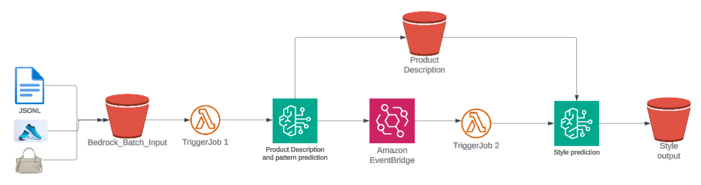
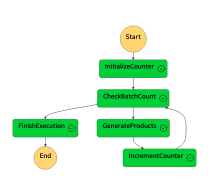

#  Retail Style Classifier: An automated product style attribution system powered by Amazon Bedrock.

🎀 An automated product style attribution system powered by Amazon Bedrock. 

## Overview
A sophisticated multimodal AI solution that transforms manual product classification into an efficient, automated process. This system leverages AWS Bedrock and Anthropic Claude to provide real-time product categorization and detailed attribute generation for retail products.

This solution improved product classification accuracy while reducing processing time to seconds per item.

## Business Problem
Luxury retail customers expect a seamless digital shopping experience where they can quickly find exactly what they're looking for. However, when a customer searches for "floral midi dress" or "pinstripe blazer" on luxury retail sites, they often face frustrating results. Products are miscategorized, patterns are mislabeled, and relevant items are missing from search results. This leads to abandoned searches, lost sales, and diminished customer trust.

Today, retailers rely on manual product classification, with teams of specialists spending hours reviewing and categorizing each item. With only 15% accuracy in automated classification, retailers face a painful choice: either delay product launches by weeks while waiting for manual review, or risk disappointing customers with inaccurate product information.

### Customer Benefit
By implementing an AI-powered style classification system, we can:

* Reduce product classification time from weeks to seconds
* Improve classification accuracy 
* Enable customers to find exactly what they're looking for on their first search
* Launch new collections faster, ensuring products are available when customers want them
* Scale operations efficiently during peak shopping seasons

## Proposed Solution


### Solution Architecture




Key features:
- Multimodal pattern recognition for complex fashion items
- Automated style attribute generation
- AI-powered product description creation
- High-throughput processing capability
- Luxury retail-specific optimizations
- Real-time e-commerce platform integration


## Getting Started

If you already have product data ready, you can skip this optional step for generating synthetic dataset

## Synthetic dataset generation(Optional)

In this section, we will be leveraging Amazon Bedrock for generating synthetic dataset

### Pre-requisite:

1. Ensure you have login into your AWS account and have permission to deploy the cloudformation template.
2. Ensure you provide access to Bedrock model Nova Pro and Nova Canvas. For more details, refer the [documentation](https://docs.aws.amazon.com/bedrock/latest/userguide/model-access.html)

### Deployment
To get-started, kindly follow the following steps:
1. Download the  [cloudformation template](synthetic_dataset.yaml)
2. Open the AWS CloudFormation console at https://console.aws.amazon.com/cloudformation. And select create stack > With new resources (Standard) option.
3. Provide parameter value for BatchSize, Number of Batches.

The template creates:

* An S3 bucket to store generated images and CSV files
* A Lambda function to generate products
* A Step Function to orchestrate multiple batches
* Necessary IAM roles and permissions




The core logic exists in the lambda function which will:
1/ We use Amazon Bedrock's Nova Pro LLM for generating synthetic product name, product description. 
2/ We pass the generated product details to Amazon Bedrock's Nova Canvas model to generate product images. 

The generated data will be organized in the S3 bucket as follows:

* /images/ - Product images
* /csvs/ - CSV files containing product data

Here is sample csv :
| Product ID | Product Name | Category | Description | Product URL | Image Path |
|------------|-------------|-----------|-------------|-------------|------------|
| 91acc3f4 | Aurora Flutter Dress | Dresses | The Aurora Flutter Dress is a whimsical piece designed for both comfort and style. | example.com/products/91acc3f4 | images/91acc3f4.png |
| 2a3c5662 | Celestial Wrap Blouse | Blouses | The Celestial Wrap Blouse is an ethereal addition to any wardrobe. | example.com/products/2a3c5662 | images/2a3c5662.png |
| 5d15cc1f | Voyager Cargo Pants | Pants | The Voyager Cargo Pants combine functionality with fashion-forward design. | example.com/products/5d15cc1f | images/5d15cc1f.png |
| ae5fe2d0 | Serene Infinity Scarf | Accessories | The Serene Infinity Scarf is a must-have accessory for any season. | example.com/products/ae5fe2d0 | images/ae5fe2d0.png |
| 809c1261 | Harmony Yoga Leggings | Activewear | The Harmony Yoga Leggings are designed for maximum comfort and flexibility. | example.com/products/809c1261 | images/809c1261.png |


The Step Function will execute the Lambda function multiple times based on the NumberOfBatches parameter, with each execution generating BatchSize number of products.

To monitor progress:

* Check the Step Function execution in the AWS Console
* Monitor the Lambda function logs in CloudWatch
* Check the S3 bucket for generated files

Note: You can update the lambda function to update the prompt per you requirement, change the model id and experiment further. 

## Product attribute and pattern determination

In this section, we will be orchestrating serverless solution. 

### Pre-requisite:

1. Ensure you have login into your AWS account and have permission to deploy the cloudformation template.
2. Ensure you provide access to Bedrock model Nova Pro and Nova Canvas. For more details, refer the [documentation](https://docs.aws.amazon.com/bedrock/latest/userguide/model-access.html)


To get-started, kindly follow the following steps:
1. Download the  [cloudformation template](cfn.yaml)
2. Open the AWS CloudFormation console at https://console.aws.amazon.com/cloudformation. And select create stack > With new resources (Standard) option.
3. Upload the template by selecting Upload a template file.
4. Specify the Stack Name.
6. In the next-page, click Submit.
Within few minutes, the entire infratructure will be created.

Step-by-Step Process Flow for Product Pattern and Style Analysis

* STEP 1: Initial CSV Upload
The process begins when a CSV file containing product information (productid, productname, productdescription, image_path) is uploaded to the designated S3 bucket's input folder.

* STEP 2: First Lambda Function Trigger
Upon detecting the CSV upload, Lambda1 is automatically triggered through an S3 event notification system.

* STEP 3: CSV Data Processing
Lambda1 reads and validates the CSV file from S3, ensuring all required columns are present and properly formatted for further processing.

* STEP 4: Image Data Preparation
The function processes each product entry by retrieving the associated image using the provided image_path, converting it to base64 format for Bedrock compatibility.

* STEP 5: Pattern Analysis JSONL Creation
Lambda1 constructs a JSONL file containing product details, base64-encoded images, and specific prompts for pattern detection and analysis.

* STEP 6: First Batch Inference Initiation
The JSONL file is uploaded to the batch-inference input folder, and a Bedrock batch inference job is initiated using the Claude model for pattern detection and analysis.

* STEP 7: Pattern Analysis Completion
Upon completion of the batch inference job, the results containing pattern identification, reasoning, and detailed image descriptions are stored in the designated S3 output folder.

* STEP 8: Second Lambda Function Activation
The completion of pattern analysis automatically triggers Lambda2 through an S3 event notification.

* STEP 9: Pattern Results Integration
Lambda2 retrieves and processes the pattern analysis results, combining them with the original product data for comprehensive style analysis.

* STEP 10: Style Analysis JSONL Preparation
A new JSONL file is created incorporating the pattern analysis results and specific prompts for style detection and reasoning.

* STEP 11: Second Batch Inference Process
Lambda2 initiates another Bedrock batch inference job, uploading the style analysis JSONL and configuring the parameters for style detection.

* STEP 12: Comprehensive Results Compilation
Upon completion of the style analysis, the system combines all results into a comprehensive output format containing style identification, reasoning, pattern details, and product information.

* STEP 13: Final Output Storage
The complete analysis results are stored in S3, organized by style categories in JSON format, marking the completion of the workflow.

Here is a record output:

```
{
  "id": "msg_bdrk_018rNeKoPMR3YsZyrNR29gPY",
  "type": "message",
  "role": "assistant",
  "model": "claude-3-haiku-20240307",
  "content": [
    {
      "type": "text",
      "text": "{\n    \"primary_style\": \"Romantic\",\n    \"secondary_styles\": [\"Feminine\", \"Elegant\"],\n    \"pattern\": \"Floral\",\n    \"reasoning\": \"The product description and visual analysis indicate that this is a romantic, feminine, and elegant dress. The long, flowing silhouette, ruffled sleeves, and delicate floral print pattern create a soft, enchanting aesthetic that aligns with the romantic style category. The feminine and elegant qualities are further evident in the v-neck design and lightweight, ankle-length skirt. The use of a subtle, muted floral print also contributes to the overall romantic and feminine style.\",\n    \"key_elements\": [\"V-neck\", \"Ruffled sleeves\", \"Flowing silhouette\", \"Floral print pattern\", \"Soft, pastel color palette\"]\n}"
    }
  ],
  "stop_reason": "end_turn",
  "stop_sequence": null,
  "usage": {
    "input_tokens": 375,
    "output_tokens": 192
  }
}
```

* Note: This entire process utilizes Bedrock's batch inference capability, resulting in a 50% cost reduction compared to on-demand processing while maintaining high accuracy in pattern and style analysis.

You can also orchestrate the workflow using Amazon StepFunctions and if required have a status table to manage the status and processing is required.


### Cost 
The cost depends on the number of calls. All the components in the code is pay per use. For more details on pricing refer to AWS pricing calculator for more details


## Contributing
 Refer [details](CONTRIBUTING.md)

## Authors and acknowledgment
Neelam Koshiya

## License
This project is licensed under the MIT License. Refer [details](LICENSE)
